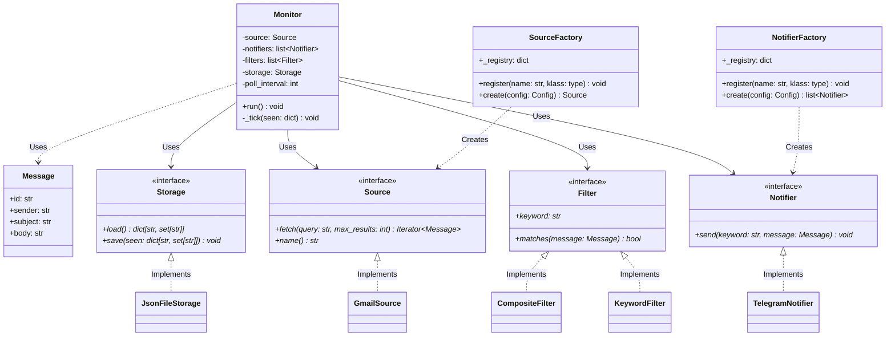
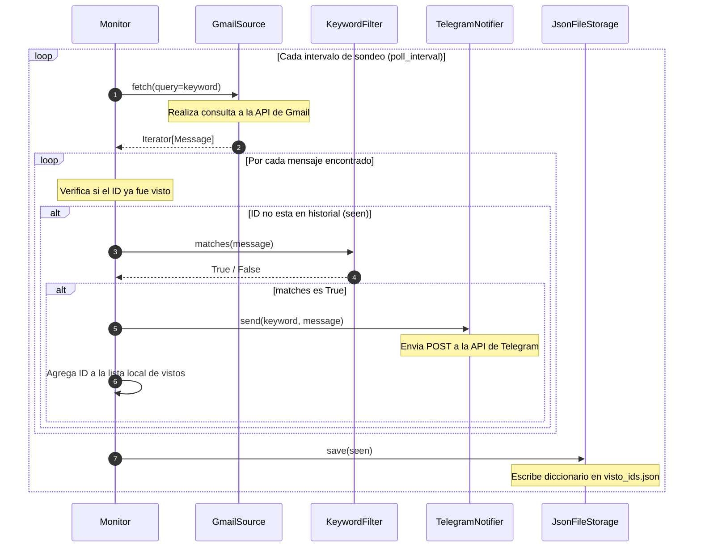

# Diagramas de Arquitectura - Hermes Notifier

Este documento contiene la representacion grafica de la arquitectura modular y los flujos del monitor de notificaciones.

---

## Diagrama de Clases (Estructura Estatica)

Muestra las interfaces abstractas definidas en 'hermes.core' y como se relacionan con sus implementaciones concretas mediante la orquestacion de Monitor y la creacion a traves de fabricas.

---

## Diagrama de Secuencia (Flujo del Bucle Monitor)

Muestra como interactuan los componentes dinamicamente en cada ciclo de revision.

